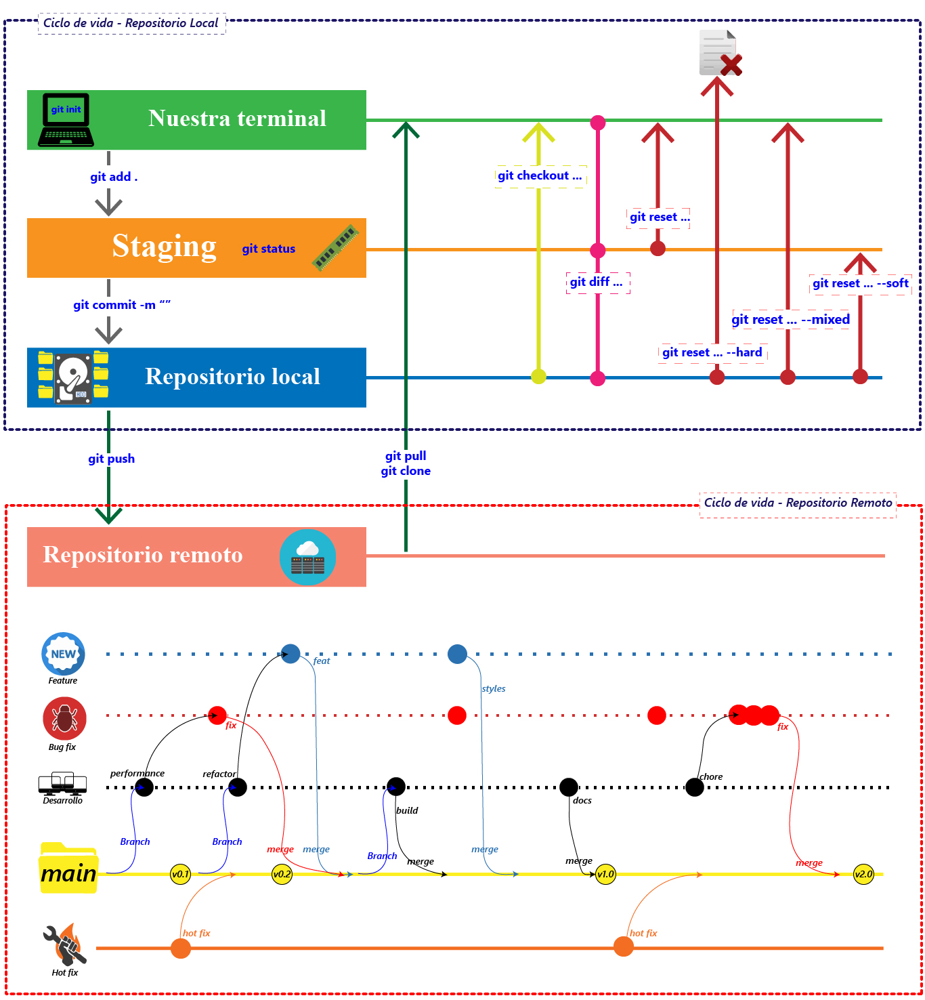

¿Qué es branch y un Merge en git?

Una rama (Branch) te permite trabajar en diferentes partes de tu proyecto sin afectar el código principal. Y un Merge te ayuda a combinar los cambios de esas ramas de manera ordenada en tu código principal, manteniendo todo organizado y sin conflictos si es posible.

*Si hay partes del código principal que se modificaron en ambas ramas, puede haber conflictos. *


# Git reset 

El comando "git checkout" junto con el ID del commit nos permite viajar en el tiempo en Git. Puedes regresar a versiones anteriores de archivos específicos o incluso del proyecto completo. También se usa para crear ramas y moverse entre ellas.

```terminal
git checkout codigoCommit nombreArchivo

git checkout main nombreArchivo
```

Otra forma de hacer esto es mediante el comando "git reset". Aquí, no solo retrocedes en el tiempo, sino que también deshaces los cambios realizados después de un commit.

Existen dos formas de utilizar "git reset":

- Con --hard, eliminas toda la información en el área de preparación (staging), perdiendo esos cambios. (Suele utilizarse)

```terminal
git reset codigoDelCommit --hard
```

- Con --soft, más seguro, mantienes los cambios en el área de preparación para aplicarlos desde un commit anterior.

```terminal
git reset codigoDelCommit --soft
```


En resumen:

- "git checkout" y "git reset" permiten regresar en el tiempo en Git.
- "git reset" ofrece opciones como --soft, --mixed y --hard para controlar cómo reviertes cambios.
- "git reset --soft [SHA 1]" elimina cambios hasta el área de preparación.
- "git reset --mixed [SHA 1]" elimina cambios hasta el directorio de trabajo.
- "git reset --hard [SHA 1]" regresa al commit con el identificador [SHA-1].


