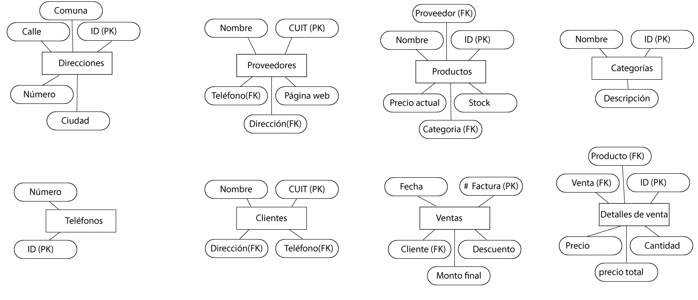
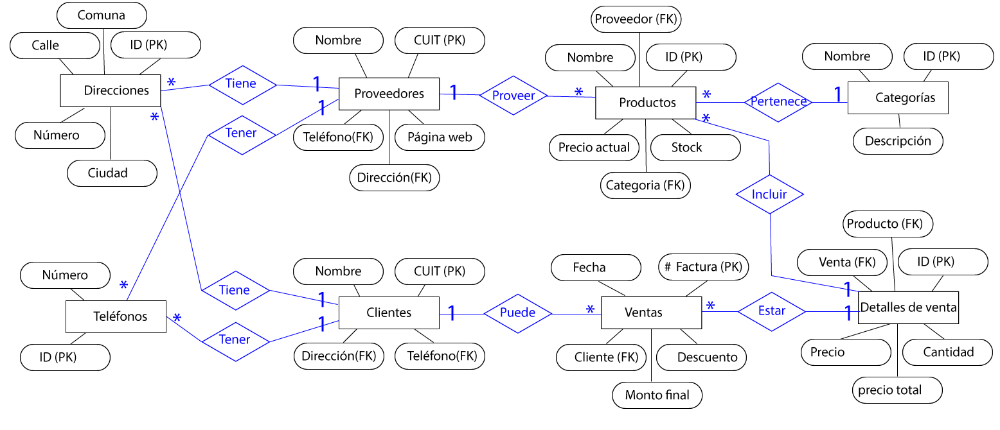
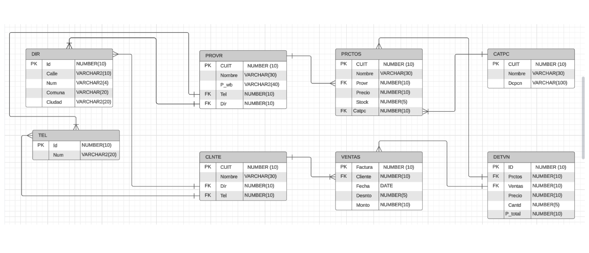

Ejemplo: BD que permita las ventas de una empresa

Se quiere diseñar una BD que permita registrar las ventas de una empresa.
Específicamente, esta empresa necesita llevar un control de proveedores, clientes,
productos y ventas.
Un *proveedor* se modela con CUIT, nombre, dirección, teléfono y página web. Un *cliente*
también se modela con CUIT, nombre y dirección, pero puede tener varios teléfonos de
contacto. De cada dirección,nos interesa su calle, número, comuna y ciudad. Tanto para
los proveedores como los clientes, el CUIT esun valor único (equivalente al DNI).
De los *productos*, sabemos que tienen un identificador único, nombre, precio actual, stock
y nombre del proveedor que los comercializa. Además se organizan en *categorías*, y cada
producto se clasifica solamente en una de ellas, pero sin embargo una categoría clasifica
varios productos. De ellas nos interesa saber suid, nombre y descripción.
Sabemos que un producto es comercializado por varios proveedores, pero que un
proveedor provee unsolo producto.
Por razones de contabilidad, se debe registrar la información de cada *venta* , las cuales
tienen un númerode factura (que es único), fecha, cliente, descuento y monto final. A
su vez, sabemos que una venta se compone de varios productos, y por eso nos interesa
el precio al momento de la venta del producto, la cantidad vendida y el monto total por
él. Tenga en cuenta que un producto puede estar en varias ventas,pero que podemos
tener un producto que no haya sido vendido. Adicionalmente, sabemos que cada clien- te
puede realizar varias ventas, y en una venta solamente participa un cliente

 
 

# Método para realizar una interpretación acertada de los requerimientos para el diseño de una base de datos.

1. **Comprensión de los requerimientos**: Leer cuidadosamente los requerimientos proporcionados por el cliente, para entender:

- ¿Qué necesita la empresa o cliente?
- ¿Cuáles son las relaciones entre entidades?
- ¿Cuáles son los requerimientos funcionales y no funcionales? (Puede ser eleborado con los casos de uso)
- ¿Cuáles son las restricciones?
- Entre otras.

Si no hay claridad en los requerimientos, considera hacer preguntas o solicitar aclaraciones.

2. **Identificación de entidades**: Identifica las entidades principales en el problema. En el ejemplo, las entidades principales son: 

- Proveedor

    - CUIT (PK)
    - Nombre
    - Dirección
    - Teléfono
    - Página web

- Cliente

    - CUIT (clave primaria)
    - Nombre
    - Dirección

- Dirección

    - ID (clave primaria)
    - Calle
    - Número
    - Comuna
    - Ciudad

- Telefonos

    - ID (Clave primaria)
    - Número

- Producto

    - ID (clave primaria)
    - Nombre
    - Precio actual
    - Stock
    - Categoría (clave foránea que hace referencia a la tabla de Categorías)
    - Proveedor (clave foránea que hace referencia a la tabla de Proveedores)

- Categoría

    - ID (clave primaria)
    - Nombre
    - Descripción

- Venta.

    - Número de factura (clave primaria)
    - Fecha
    - Cliente (clave foránea que hace referencia a la tabla de Clientes)
    - Descuento
    - Monto final

- Detalle de la venta 

    - ID (clave primaria)
    - Venta (clave foránea que hace referencia a la tabla de Ventas)
    - Producto (clave foránea que hace referencia a la tabla de Productos)
    - Precio al momento de la venta
    - Cantidad vendida
    - Monto total por el producto

Anota todas las propiedades (*atributos*) asociadas con cada *entidad*.

3. **Identificación de relaciones**: Las relaciones pueden ser uno a uno, uno a muchos o muchos a muchos. Anota todas las relaciones clave entre las entidades.

- Un Proveedor puede proveer varios productos, pero un producto solo tiene un proveedor (relación uno a muchos entre Proveedor y Producto).

- Un Producto pertenece a una Categoría, pero una Categoría puede clasificar varios productos (relación uno a muchos entre Categoría y Producto).

- Un Cliente puede tener varios teléfonos de contacto (relación uno a muchos entre Cliente y Teléfono).

- Una Venta puede incluir varios productos, y un producto puede estar en varias ventas (relación muchos a muchos entre Venta y Producto a través de la tabla Detalle de Venta).

- Cada Venta está asociada a un único Cliente (relación muchos a uno entre Venta y Cliente).

4. **Normalización de datos**: Piensa en cómo organizar los datos de manera eficiente y sin redundancias. Puedes aplicar conceptos de normalización de bases de datos para asegurarte de que la información se almacene de manera eficaz y coherente.

5. **Diseño de la Estructura de Tablas**: Crea una estructura de tablas que refleje las entidades y relaciones identificadas. Define las claves primarias y las claves foráneas para establecer relaciones entre las tablas. Asegúrate de que cada atributo tenga su propio campo en una tabla correspondiente.

6. **Determinación de las Restricciones de Integridad**: Define las restricciones de integridad para garantizar la consistencia y la precisión de los datos. Esto incluye la definición de claves primarias, claves foráneas y otras restricciones como UNIQUE, NOT NULL, entre otras.

7. **Diseño de Vistas y Consultas**: Piensa en las consultas y vistas que la empresa podría necesitar para acceder a la información de la BD. Diseña estas consultas y vistas de antemano para facilitar el acceso a los datos.

8. **Validación del Diseño**: Revise el diseño de la BD con colegas o expertos en bases de datos para obtener retroalimentación y validar que el diseño cumple con los requerimientos de la empresa.

9. **Implementación de la BD**: Una vez que el diseño sea sólido, procede a implementar la BD utilizando un sistema de gestión de bases de datos (DBMS) de tu elección.

10. **Pruebas y Mantenimiento**: Realiza pruebas exhaustivas para asegurarte de que la BD funcione como se espera. A medida que la empresa evolucione, asegúrate de que la BD se mantenga actualizada y se adapte a nuevas necesidades.

11. **Documentación**: Documenta el diseño de la BD, las restricciones de integridad, las consultas frecuentes y cualquier otra información relevante para que sea fácil de comprender y mantener.
