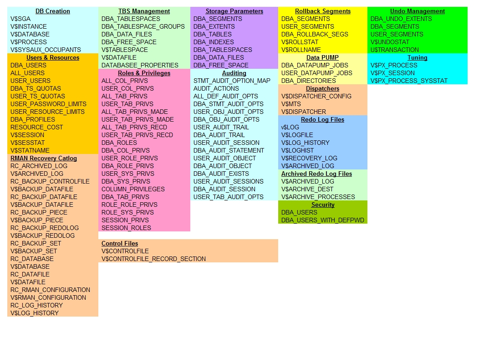

# Glosario de palabras RDBMS

## Contenido

[1. Instancias / Instance](#instance)

[2. Esquema / Schema](#schema)

[3. Tabla / Table](#table)

[4. Columna / Column](#column)

[5. Fila / Row](#row)

[6. Llave primaria / Primary key](#primary-key)

[7. Llave foránea / Foreign key](#foreign-key)

[8. Índice / Index](#index)

[9. Consulta / Query](#query)

[10. SQL](#sql-lenguaje-de-consulta-estructurado)

[11. SELECT](#sentencia-select)

[12. WHERE](#cláusula-where)

[13. JOIN](#join)

[14.  Normalization / Normalización](#normalización)

[15.  Denormalization / Desnormalización](#desnormalización)

[16. Propiedades ACID / ACID properties](#acid-properties)

[17. Vistas / View](#view)

[18. Procedimiento almacenado / Stored Procedure](#stored-procedure)

[19. Disparador / Trigger](#trigger)

[20. Copia de seguridad / Backup](#backup)

[21. Recuperación / Recovery](#recovery)

[22. Registro de rehacer / Redo Log](#redo-log)

[23. Archivado / Archiving](#archiving)

[24. Diccionario de datos / Data dictionary](#data-dictionary)

[25. Privilegios / Privileges](#privileges)

[26. Rol / Role](#role)

[27. Instance Crash](#instance-crash)

[28. PL/SQL](#plsql)

[29. LOB](#lob)

[30. OLTP](#oltp)

[31. OLAP](#olap)

[32. Requerimientos funcionales y no funcionales](#requerimientos-funcionales-y-no-funcionales)

[33. Modelo Entidad / Relación vs modelo relacional]()

#### **Instance**: 
Un entorno de base de datos Oracle en ejecución asociado a estructuras de memoria y procesos en segundo plano.

#### **Schema**: 
Un contenedor lógico para objetos de base de datos como tablas, vistas e índices, propiedad de un usuario.

#### **Table**: 
Se utiliza para organizar y almacenar datos en forma de filas y columnas. Cada fila representa un registro o una entrada en la tabla, mientras que cada columna representa un atributo o campo específico de esos registros.

#### **Column**: 
Elemento de datos vertical de una tabla que contiene tipos específicos de datos.

#### **Row**: 
Elemento de datos horizontal de una tabla que representa un único registro de datos.

#### **Primary key**: 
Identificador único de una fila de una tabla, que garantiza la integridad de los datos y permite realizar búsquedas eficaces.

#### **Foreign Key**: 
Campo que establece un vínculo entre dos tablas, garantizando la integridad referencial.

#### **Index**: 
Estructura de datos que mejora la velocidad de recuperación de datos al proporcionar una forma rápida de localizar filas en una tabla.

#### **Query**: 
Solicitud de información a la base de datos mediante SQL.

#### **SQL (Lenguaje de consulta estructurado)**: 
Lenguaje utilizado para comunicarse con bases de datos relacionales y gestionarlas.

#### **Sentencia SELECT**: 
Una sentencia SQL utilizada para recuperar datos de una o más tablas.

#### **Cláusula WHERE**: 
Cláusula utilizada en SQL para filtrar filas en función de una condición especificada.

#### **JOIN**: 
Combinación de datos de varias tablas basada en columnas relacionadas.

#### **Normalización**: 
Proceso de diseño de un esquema de base de datos para minimizar la redundancia de datos y garantizar su integridad.

#### **Desnormalización**: 
Introducción intencionada de redundancia para mejorar el rendimiento de la consulta.

#### **Transaction**: 
Una única unidad de trabajo o una serie de acciones que deben tratarse como un todo.

#### **ACID Properties**: 
Conjunto de propiedades (*Atomicidad, Consistencia, Aislamiento, Durabilidad*) que garantizan un procesamiento fiable de las transacciones de una base de datos.

#### **View**: 
Tabla virtual derivada de una o más tablas o vistas, que presenta los datos de una forma específica.

#### **Stored procedure**: 
Una colección precompilada de una o más sentencias SQL que pueden ejecutarse como una sola unidad.

#### **Trigger**: 
Objeto de base de datos que se ejecuta automáticamente en respuesta a eventos especificados.

#### **Backup**: 
Copia de datos utilizada para restaurar la base de datos en caso de pérdida o corrupción de datos.

#### **Recovery**: 
El proceso de restaurar la base de datos a un estado consistente después de un fallo.

#### **Redo Log**: 
Conjunto de archivos que registran los cambios realizados en la base de datos, esencial para la recuperación.

#### **Archiving**: 
Traslado de los archivos de redo log llenos a una ubicación diferente para su almacenamiento a largo plazo.

#### **Data Dictionary**: 
Una colección de metadatos sobre la estructura y los objetos de la base de datos.

#### **Privileges**: 
Permisos que controlan el acceso de un usuario a objetos específicos de la base de datos.

#### **Role**: 
Un grupo nombrado de privilegios que se pueden conceder a los usuarios.

#### **Instance Crash**: 
Cuando la instancia de Oracle termina anormalmente debido a un error o fallo de hardware.

***

### PL/SQL 
Permite realizar tareas más avanzadas dentro de la base de datos de Oracle, como automatizar procesos, realizar cálculos complejos y mantener la integridad de los datos mediante la definición de reglas y restricciones personalizadas.

| SQL | PL/SQL |
|-----|--------|
| Es el lenguaje utilizado para realizar consultas y operaciones en las bases de datos. Se utiliza para recuperar, insertar, actualizar y eliminar datos en las tablas.    |  Es un lenguaje que extiende las capacidades de SQL al permitirte escribir programas o bloques de código que se ejecutan directamente en la base de datos. Esto significa que puedes crear procedimientos, funciones, desencadenadores y otros elementos de lógica de programación en la base de datos.      |

### LOB: 
Tipo de datos para almacenar datos grandes como imágenes, archivos de sonido y documentos.

### OLTP: 
Sistema de procesamiento de transacciones en tiempo real para operaciones individuales.

### OLAP: 
Sistema de procesamiento analítico para consultas complejas en datos históricos o multidimensionales.

## Requerimientos funcionales y no funcionales

| R. funcional | R. no funcional |
|-----|--------|
|  Lo que el sistema debe hacer. Son las tareas y capacidades concretas que el sistema debe cumplir.  | Cómo debe hacerlo. Son las condiciones y características que determinan cómo el sistema debe comportarse, incluso si no se trata de funciones específicas.       |

***Ejemplo R. Funcional:***

- "El sistema debe permitir a los usuarios iniciar sesión con nombre de usuario y contraseña."
- "Los usuarios deben poder agregar nuevos registros a la base de datos."
- "Se debe poder ejecutar consultas SQL para recuperar información de la base de datos."

***Ejemplo R. no funcional:***

- "El sistema debe responder a las consultas en menos de 2 segundos."
- "Debe ser capaz de manejar simultáneamente al menos 1000 usuarios."
- "La base de datos debe ser segura y solo accesible por usuarios autorizados."

### Modelo Entidad/Relación vs Modelo relacional

Son dos enfoques diferentes para diseñar y representar bases de datos.

| E/R | Relacional |
|-----|--------|
|   Utiliza símbolos como círculos (entidades) y líneas (relaciones) para mostrar cómo las cosas están conectadas.    |    Las entidades se convierten en tablas, y las relaciones se convierten en cómo las tablas se relacionan entre sí. Utiliza filas y columnas para almacenar los datos de manera organizada.    |
|  El Modelo Entidad/Relación te ayuda a planificar cómo se verá tu base de datos   |    El Modelo Relacional es la forma real de organizar los datos en tablas y relaciones.     |

