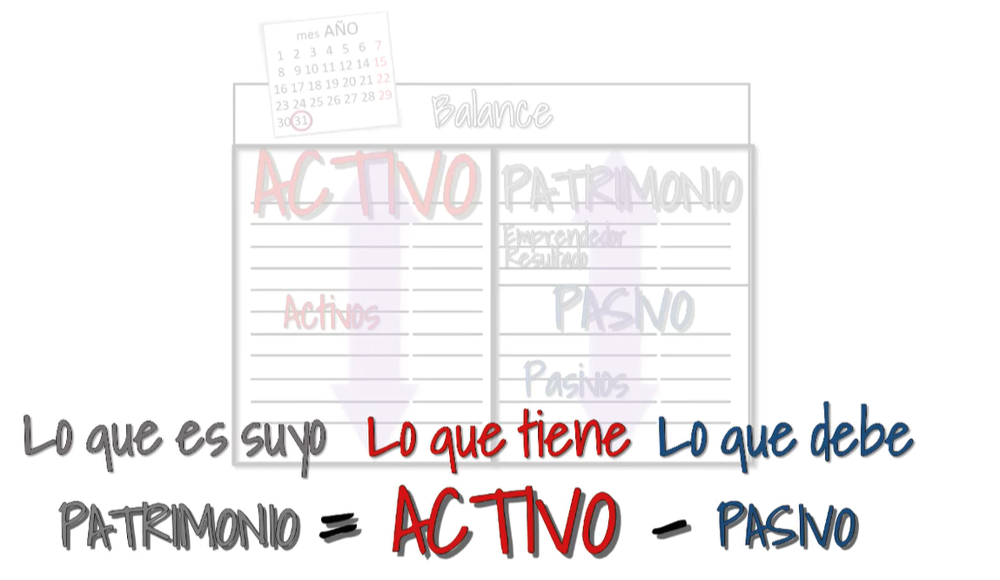

# **Balance General**

Conocido tambien como estado de situación financiera, es un estado financiero que refleja en un momento determinado la información económica y financiera de una empresa.

Se separa en tres grupos:

- Activo
- Pasivo
- Patrimonio

Muestra cuanto efectivo tiene la empresa, la cantidad de deuda contraida y los bienes que dispone en un momento determinado.

# **El estado de resultados**

1. Determinar la utilidad bruta
    
    Utilidad bruta = ingresos por ventas - costos de ventas

2. Calcular gastos de administración y utilidad operacional.

- Servicios publicos
- Alquiler
- Empleados

    Utilidad operacional = Utilidad bruta - gastos de administración

3. Calcular utilidad antes de impuestos.

- Ingresos.
- Gastos financieros.
- Otros ingresos.
- Gastos diversos.

    Utilidad antes de impuestos = ingresos - gastos de la utilidad operacional.

4. Calcular impuesto de renta y utilidad neta

- Aplicar la tarifa del impuesto de renta (Tarifa general 35%, tarifa total 38% en Colombia 2022 - 2025) 

    impuesto de renta = utilidad antes de impuesto * 38%

    Utilidad neta = utilidad antes de impuestos - impuesto de renta

 
 

# Análisis horizontal(Estado de perdida y ganacias o estado de resultados)

Análisis dinamicos ya que se emplean estados financieros de por lo menos dos periodos de tiempo para su realización

Variación absoluta: Se obtiene de la diferencia del año reciente al año anterior.

Variación relativa: Se obtiene de la diferencia del año reciente al año anterior dividido el valor del año anterior.

# Análisis vertical de un estado de resultados

Análisis estático, solo se emplea un periodo de tiempo. Determina la contribución relativa de cada elemento del estado de resultados al total de ingresos o ventas, lo que permite identificar tendencias, comparar diferentes periodos y evaluar la eficiencia y la rentabilidad de la empresa.

Costo de ventas dividido entre los ingresos totales por 100%