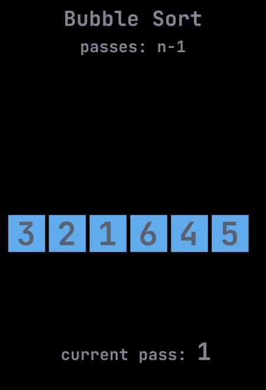
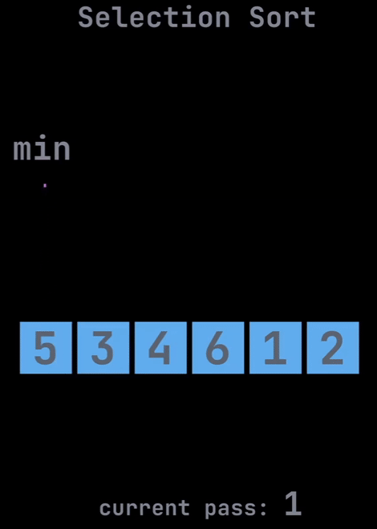
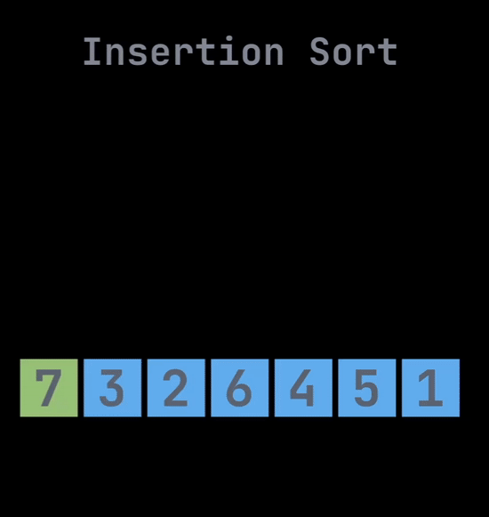
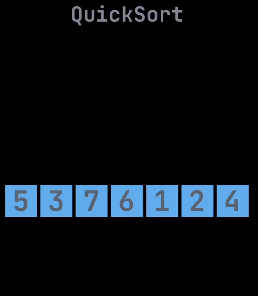
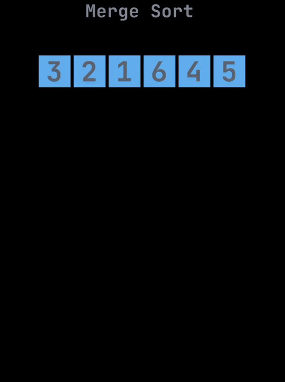

# **Algoritmos de ordenamiento**

---

Los algoritmos de ordenamiento son herramientas fundamentales en el campo de la informática y la programación, se encarga de colocar en orden una secuencia dada convirtiendo un arreglo desordenado en un arreglo ordenado

<br>
<br>

### 1. ***Método burbuja (Bubble Sort)***

Se ordena por pares y se va repitiendo 1 a 1 hasta que queda totalmente ordenado, es muy iterativo, poco eficiente (por la cantidad de iteraciones), pero muy sencillo de ejecutar.



[Creditos: worldofivo](https://www.instagram.com/worldofivo/)

<details>
  <summary><b>Código en Java</b></summary>

``` Java
public void swap(int arr[], i, j){
    int temp = arr[i];
    arr[i] = arr[j];
    arr[j] = temp; 
}

public void sort(int arr[]){
    int size = arr.length;
    boolean swapped;

    for(int i = 0; i < size - 1; i++){
        swapped = false;
        for(int j = 0; j < size - i - 1; j++){
            if(arr[j] > arr[j+1]){
                swap(arr, j, j+1);
                swapped = true;
            }
        }
    }
    if(!swapped){
        break;
    }
}

public void display(int arr[]){
    int size = arr.length;
    for(int num : size){
        System.out.print(num + " ");
    }
    System.out.println();
}
```

</details>

<br>

### 2. ***Método de selección (Selection Sort)***

Es un algoritmo de ordenamiento que selecciona el elemento más pequeño de una lista no ordenada en cada iteración y coloca ese elemento al principio de la lista no ordenada



[Creditos: worldofivo](https://www.instagram.com/worldofivo/)

<details>
  <summary><b>Código en Java</b></summary>

``` Java
public void sort(int arr[]){
    selectionSort(arr, arr.length);
}

public void selectionSort(int arr[], int size){
    for(int = 0; i < size - 1; i++){
        int min = i;

        for(int j = i + 1; j < size; j++){
            if(arr[j] > arr[min]){
                min = j;
            }
        }

        int temp = arr[min];
        arr[min] = arr[i];
        arr[i] = temp;
    }
}

public void display(int arr[]){
    for(int num : arr){
        System.out.print(num + " ");
    }
    System.out.println();
}

```

</details>

<br>

### 3. ***Método de inserción (Insert Sort)***

Vas comparando los elementos hasta que encuentren su lugar en la serie de 1 a 1.
Es un algoritmo eficiente para serie de datos cortas, pero no para largas.



[Creditos: worldofivo](https://www.instagram.com/worldofivo/)

<details>
  <summary><b>Código en Java</b></summary>

``` Java
public void sort(int arr[]){
    int size = arr.length;

    for (int i = 1; i < size; i++){
        int currentValue = arr[i];
        int j = i - 1;

        while (j >= 0 && arr[j] > currentValue){
            arr[j+1] = arr[j];
            j = j - 1;
        } 
        arr[j+1] = currentValue;
    }
}

public void display(int arr[]){
    for (int num : arr){
        System.out.print(num + " ");
    }
    System.out.println();
}
```
</details>

<br>

### 4. ***Método rápido (Quick Sort)***

Utiliza el paradigma divide and conquer, y va comparando desde las esquinas al centro, es muy eficiente para serie de datos largos por lo que es de los más importantes.



[Creditos: worldofivo](https://www.instagram.com/worldofivo/)

<details>
  <summary><b>Código en Java</b></summary>

``` Java
public void sort(int arr[]){
    quickSort(arr, 0, arr.length - 1);
}

private void partition(int arr[], int low, int high){
    int pivot = arr[high];
    int i = low - 1;

    for (int j = low; j < high; j++){
        if(arr[j] <= pivot){
            i++;
            int temp = arr[j];
            arr[j] = temp;
        }
    }
    int temp = arr[ i + 1];
    arr[i + 1] = arr[high];
    arr[high] = temp;

    return i + 1;

}

private void quickSort(int arr[], int low, int high){
    if( low < high){
        int pi = partition(arr, low, high);
        quickSort(arr, low, pi - 1);
        quickSort(arr, pi + 1, high);
    }
}

public void display(int arr[]){
    for(int num : arr){
        System.out.print(num + " ");
    }
    System.out.println();
}
```

</details>

<br>

### 5. ***Método de mezcla (Merge Sort)*** 

Utiliza el paradigma divide y vencerás, Dividiendo los elementos para compararlos y posteriormente volverlos a unir ordenados de la manera correcta.
Es un algoritmo eficiente para muchos datos, pero no lo es tanto para pocos



[Creditos: worldofivo](https://www.instagram.com/worldofivo/)

<details>
  <summary><b>Código en Java</b></summary>

``` Java
public void sort(int arr[]) {
        mergeSort(arr, 0, arr.length - 1);
    }

private void merge(int arr[], int l, int m, int r) {
    int n1 = m - l + 1;
    int n2 = r - m;

    int L[] = new int[n1];
    int R[] = new int[n2];

    for (int i = 0; i < n1; ++i)
        L[i] = arr[l + i];
    for (int j = 0; j < n2; ++j)
        R[j] = arr[m + 1 + j];

    int i = 0, j = 0;
    int k = l;

    while (i < n1 && j < n2) {
        if (L[i] <= R[j]) {
            arr[k] = L[i];
            i++;
        } else {
            arr[k] = R[j];
            j++;
        }
        k++;
    }

    while (i < n1) {
        arr[k] = L[i];
        i++;
        k++;
    }

    while (j < n2) {
        arr[k] = R[j];
        j++;
        k++;
    }
}

private void mergeSort(int arr[], int l, int r) {
    if (l < r) {
        int m = (l + r) / 2;
        mergeSort(arr, l, m);
        mergeSort(arr, m + 1, r);
        merge(arr, l, m, r);
    }
}

public void display(int arr[]) {
    int n = arr.length;
    for (int i = 0; i < n; ++i)
        System.out.print(arr[i] + " ");
    System.out.println();
}

```

</details>

<br>

# Recursividad

La recursividad es un concepto en programación que implica que una función o procedimiento se llame a sí mismo para resolver un problema. Es decir, una función recursiva se define en términos de sí misma, dividiendo el problema original en subproblemas más pequeños y resolviéndolos de manera recursiva hasta alcanzar un caso base.

## Recursión

La recursión se basa en la idea de que un problema puede resolverse más fácilmente si se puede dividir en instancias más pequeñas del mismo problema. Cada llamada recursiva resuelve una instancia más pequeña del problema hasta que se alcanza un caso base, que es una instancia lo suficientemente simple como para ser resuelta directamente sin hacer llamadas recursivas adicionales.

<details>
  <summary><b>Código en Java</b></summary>

``` Java
// Factorial con recursividad
public void factorial(int n){
    if (n == 0){
        return 1;
    }
    return (n * factorial (n - 1));
}

// Factorial por iteraciones
public void factorial(int n){
    for(int i=1; i<=n; i++)
        result +=i;
}

// Voltear una cadena de caracteres con recursividad
public String reverseString(String str){
    if (str.isEmpty()){
        return str;
    } else {
        return reverseString(str.substring(1)) + str.charAt(0);
    }
}

// Voltear una cadena de caracteres por iteración
public String reverseString(String str) {
    StringBuilder reversed = new StringBuilder();
    
    for (int i = str.length() - 1; i >= 0; i--) {
        reversed.append(str.charAt(i));
    }
    
    return reversed.toString();
}
```

La función factorial se llama a sí misma para calcular el factorial de un número n. Cada llamada recursiva reduce el problema original al calcular el factorial de n-1, y así sucesivamente, hasta que se alcanza el caso base cuando n es igual a 0.

</details>

<br>

En algunos casos, una solución iterativa puede ser más eficiente que una solución recursiva.

<br>

# Greedy Algorithm

Los algoritmos greedy (o voraces) son una categoría de algoritmos en la que se toma una decisión óptima en cada etapa local con la esperanza de alcanzar una solución global óptima. Estos algoritmos siguen un enfoque heurístico que se basa en tomar la mejor opción disponible en el momento actual sin preocuparse por las consecuencias futuras.

1. Algoritmo de la mochila (Knapsack problem): Selecciona los elementos más valiosos para incluir en una mochila, teniendo en cuenta la capacidad limitada de la mochila.

2. Algoritmo de Kruskal: Encuentra un árbol de expansión mínima en un grafo ponderado, seleccionando de manera voraz las aristas más pequeñas y evitando ciclos.

3. Algoritmo de Prim: Encuentra un árbol de expansión mínima en un grafo ponderado, comenzando desde un vértice y agregando iterativamente la arista de menor peso que conecta un vértice visitado con uno no visitado.

4. Algoritmo de Dijkstra: Encuentra la ruta más corta entre dos nodos en un grafo ponderado, seleccionando vorazmente los nodos con la distancia mínima al origen.

<details>
  <summary><b>Código en Java (Ejemplo de cambio)</b></summary>

``` Java
public static void main(String[] args) {
    int[] billete = {50, 20, 10, 5, 2, 1};
    int nb = 6;
    int i = 0;
    int deuda = 138;

    greedyCoins(deuda, i, billete, nb);
}

public static void greedyCoins(int deuda, int i, int[] billete, int nb) {
    if (deuda == 0) {
        System.out.println("Pago completado");
        return;
    } else {
        int pagoDisp = deuda / billete[i];
        if (pagoDisp > 0) {
            int pagoRealizado = billete[i] * pagoDisp;
            System.out.println(pagoRealizado);
            deuda -= pagoRealizado;
        }
    }

    if (i < nb) {
        i += 1;
        greedyCoins(deuda, i, billete, nb);
    } else {    
        System.out.println("Pago completado");
    }
}

```

La función factorial se llama a sí misma para calcular el factorial de un número n. Cada llamada recursiva reduce el problema original al calcular el factorial de n-1, y así sucesivamente, hasta que se alcanza el caso base cuando n es igual a 0.

</details>

<br>