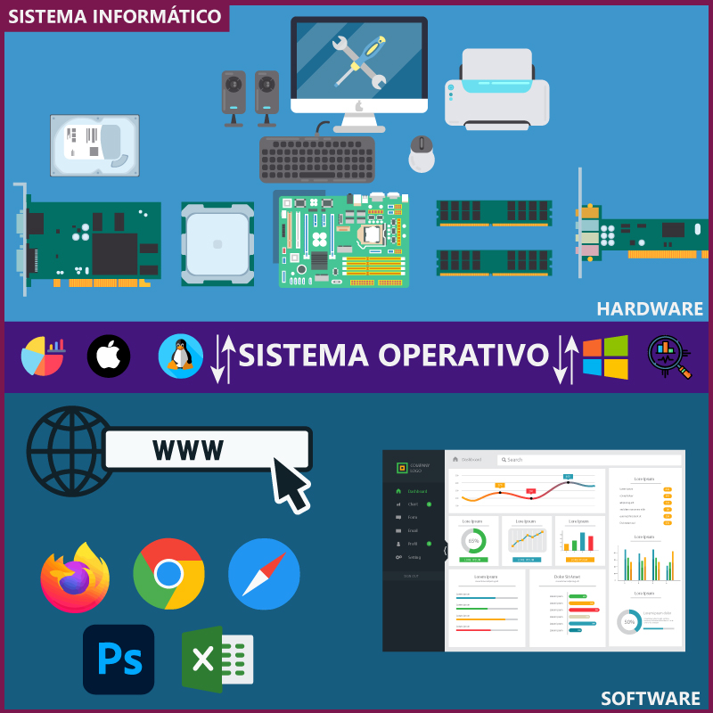
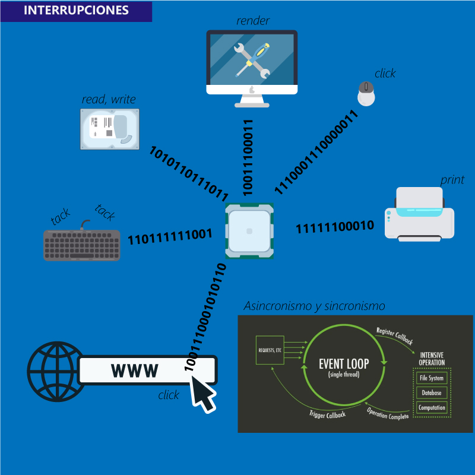

###### Mis notas obtenidas en el libro "Fundamentos de Sistemas Operativos, 7ma Edición, Silberschatz Galvin Gagne"

# ¿Qué hace un sistema operativo?

Primeramente, analizamos la función de un sistema operativo en un entorno informático integral.

Un sistema informático puede dividirse en cuatro componentes:

- El hardware, la unidad de procesamiento, la memoria y los dispositivos de E/S, proporcionan los recursos básicos de cómputo al sistema. (Hardware, software y datos) 

- Los programas de aplicación, como los procesadores de texto, las hojas de cálculo, los compiladores y los exploradores web, definen las formas en que estos recursos se emplean para resolver los problemas informáticos de los usuarios. 

El sistema operativo controla y coordina el uso del hardware entre los diversos programas de aplicación por parte de los distintos usuarios.

El sistema proporciona los medios para hacer un uso adecuado de estos recursos durante el funcionamiento del sistema

## Sistema visto desde el usuario

La perspectiva del usuario es diversa de acuerdo a la interfaz que utilice. 

- La mayoría usa monitor, teclado, ratón y una unidad de sistema, un sistema así se diseña para que el usuario pueda monopolizar sus recursos.

    

    - Maximizar el trabajo que el usuario realice. 

    - El sistema operativo está diseñado principalmente para que sea de fácil uso.

    - Presta cierta atención al rendimiento y ninguna a la utilización de recursos

     
     

- Mainframe o una microcomputadora:
    
    

    Otros usuarios pueden acceder simultáneamente desde otros terminales, estos usuarios comparten recursos e información. 

    - El sistema opereativo está diseñado para maximizar la utilización de recursos-

    - El CPU, la memoria y E/S disponibles se usan de forma equitativa en todo el sistema.

     
     

- Estaciones de trabajo conectadas a otras y servidores. 

    

    - Estos usuarios tienen recursos dedicados a su disposición.

    - Tambien tienen recursos compartidos como la red y los servidores (servidores de archivos, calculo, impresion, etc)

 
 

> Por tanto, un sistema operativo está diseñado para llegar a un compromiso entre la usabilidad individual y la utilización de recursos.

 
 

Tambien existen computadoras que tienen poca o ninguna interacción con los usuarios. Por ejemplo, en algunos electrodomesticos y en los automoviles, disponen de teclados numericos e indicadores luminosos para representar algún estado, los sistemas operativos estan diseñados para que no necesite intervención del usuario.

 

## Sistema visto desde el sistema

El sistema operativo es el programa más intimmamente relacionado con el hardware. 

- Puede ser visto como un asignador de recursos. 

- Se enfrenta a numeros y posibles solicitudes conflictivas de recursos.

- Se encarga de que la computadora opere de manera eficiente y equitativa.

- Un sistema operativo es como un programa de control, gestiona la ejecución de los programas de usuario para evitar errores y mejorar el uso de la computadora.

- Funcionamiento y control de los dispositivos E/S.

 

## Definición del sistema operativo

Es aquel programa que se ejecuta continuamente en una computadora, es critico para el rendimiento y la estabilidad del sistema. 

Es aquel que gestiona los recursos de hardware y permite que las aplicaciones y los procesos se comuniquen con el hardware de la computadora. El kernel actúa como una capa de abstracción entre el hardware y el software, facilitando la interacción.

 
 

## Organización de una computadora

 

### Funcion de una computadora

Una computadora moderna de proposito general consta de una o mas CPU y de una serie de controladores de dispositivo conectadas atraves de un bus común que proporciona acceso a una memoria compartida.

Cada controladora de dispositivo se encarga de un tipo especifico de dispositivo (discos, audio, pantalla de video, etc)

Para asegurar el acceso de forma ordenada a la memoria compartida se proporciona una controladora de memoria cuya función es sincronizar el acceso a la misma.

Para que una computadora comience a funcionar debe existir un programa de inicio. Normalmente se almacena en una memoria ROM o EEPROM y se conoce generalmente como ***firmware***, dentro del hardware de la computadora.

El programa de arranque debe saber como cargar el sistema operativo e iniciar la ejecución de dicho sistema. Para conseguirlo el programa localiza y carga en memoria el kernel del sistema operativo. Despues comienza ejecutando el primer proceso y espera a que se produzca algun suceso.

La ocurrencia de un suceso normalmente se indica mediante una interrupción bien sea del hardware o bien del software. El hardware puede activar una interrupción en cualquier instante enviando una señal a la CPU, normalmente a través del bus del sistema. El software puede activar una interrupción ejecutando una operación especial denominada llamada del sistema(***System call***)

Cuando se interrumpe a la CPU, deja lo que esta haciendo e inmediatamente transfiere la ejecución a una posición establecida, el sistema implica el uso de una tabla de punteros, que se almacena en la memoria generalmente en las primeras 100 posiciones. Cada posición almacena la dirección de la rutina de servicio correspondiente para un dispositivo específico. Cuando se genera una interrupción, se utiliza un número de dispositivo único para indexar la tabla de punteros y obtener la dirección de la rutina de servicio adecuada. 
Si la rutina de interrupción necesita modificar el estado del procesador, como los valores de los registros, debe guardar y luego restaurar explícitamente el estado actual antes de continuar. Después de manejar la interrupción, la dirección de retorno guardada se carga en el contador de programa, y el cálculo interrumpido se reanuda como si la interrupción no hubiera ocurrido.

### Estructura de almacenamiento

En un sistema de computadora, los programas deben estar almacenados en la memoria principal (RAM) para poder ejecutarse. La memoria principal es el único lugar de almacenamiento grande al que la CPU puede acceder directamente. Se utiliza tecnología de semiconductores llamada DRAM (memoria dinámica de acceso aleatorio) para implementar la memoria principal, que organiza la información en una matriz de palabras de memoria, cada una con su propia dirección.

El procesador interactúa con la memoria principal a través de instrucciones de carga (load) y almacenamiento (store) que mueven datos entre la memoria y registros internos de la CPU. Además de las instrucciones explícitas de carga y almacenamiento, la CPU carga automáticamente instrucciones desde la memoria principal para su ejecución.

En un ciclo típico de instrucción-ejecución, una instrucción se extrae de la memoria, se almacena en el registro de instrucciones, se decodifica y, si es necesario, se extraen operandos de la memoria para su procesamiento. Luego, el resultado se almacena nuevamente en la memoria principal.

La memoria principal es *volátil*, lo que significa que pierde su contenido cuando se corta la alimentación. Debido a la limitación de espacio y la volatilidad de la memoria principal, la mayoría de los sistemas informáticos proporcionan almacenamiento secundario para almacenar programas y datos de forma permanente.

La memoria caché se utiliza a menudo para mejorar el rendimiento al reducir los tiempos de acceso entre componentes con diferentes velocidades.

### Estructura de E/S

Los dispositivos de entrada y salida (E/S) son fundamentales en un sistema informático y se gestionan a través del sistema operativo para garantizar la fiabilidad y el rendimiento del sistema. En una computadora de propósito general, hay una o más CPU y múltiples controladoras de dispositivo que se conectan mediante un bus común. Cada controladora maneja un tipo específico de dispositivo, y puede haber varios dispositivos conectados a una misma controladora.

El sistema operativo generalmente tiene un controlador de dispositivo para cada controladora de dispositivo. Estos controladores permiten que el sistema operativo se comunique de manera uniforme con los dispositivos periféricos, a pesar de las diferencias en el hardware subyacente.

Cuando se inicia una operación de E/S, el controlador de dispositivo carga los registros adecuados de la controladora de hardware. La controladora de hardware interpreta estos registros y realiza la acción correspondiente, como leer un carácter del teclado. Después, inicia la transferencia de datos desde el dispositivo a su búfer local. Una vez completada la transferencia, la controladora de hardware informa al controlador de dispositivo a través de una interrupción. Luego, el controlador devuelve el control al sistema operativo, que puede devolver los datos obtenidos o información de estado.

Para operaciones de transferencia masiva de datos, como la E/S de disco, se utiliza el acceso directo a memoria (DMA). La controladora de hardware configura búferes, punteros y contadores para el dispositivo de E/S y realiza la transferencia de un bloque completo de datos entre su búfer y la memoria, sin intervención de la CPU. Se genera una interrupción por bloque, en lugar de una interrupción por byte en dispositivos de baja velocidad, para informar al controlador de dispositivo del final de la operación. Esto permite que la CPU esté disponible para otras tareas mientras se realiza la transferencia de datos.

 

## Arquitectura de un sistema informatico

### Sistemas de un solo procesador

En un sistema informático con un único procesador, la CPU principal es capaz de ejecutar un conjunto de instrucciones de propósito general, incluyendo las instrucciones de los procesos de usuario. Sin embargo, la mayoría de estos sistemas también incluyen otros procesadores de propósito especial. Estos procesadores pueden ser específicos de dispositivos como discos, teclados o controladoras gráficas, o en sistemas mainframe, pueden ser procesadores de propósito general diseñados para tareas específicas, como la transferencia rápida de datos entre componentes del sistema.

Los procesadores de propósito especial ejecutan un conjunto limitado de instrucciones y generalmente no ejecutan procesos de usuario. En algunos casos, el sistema operativo los gestiona enviándoles información sobre sus tareas y supervisando su estado. Por ejemplo, un microprocesador en una controladora de disco puede recibir solicitudes de la CPU principal y administrar su propia cola de tareas de disco y algoritmo de programación.

### Sistemas multiprocesador

Tienen dos o más procesadores que se comunican entre sí y comparten recursos como el bus de la computadora, la memoria y los dispositivos periféricos. 

- **Mayor rendimiento**: A medida que se añaden más procesadores, se espera que el trabajo se realice más rápido. Sin embargo, la mejora de velocidad con N procesadores no es lineal y puede ser menor que N debido a la carga de trabajo necesaria para coordinarlos y la contienda por los recursos compartidos.

- **Economía de escala:** Los sistemas multiprocesador pueden resultar más económicos que tener múltiples sistemas de un solo procesador, ya que pueden compartir periféricos, almacenamiento masivo y fuentes de alimentación. 

- **Mayor fiabilidad:** Los sistemas multiprocesador pueden seguir funcionando incluso si uno de los procesadores falla. Si hay diez procesadores y uno falla, los nueve restantes pueden asumir parte de su trabajo, lo que ralentizará el sistema en lugar de dejarlo inoperable. Esto se conoce como degradación suave. Algunos sistemas tolerantes a fallos pueden continuar operando a pesar de los fallos en componentes individuales.

Existen dos tipos principales de sistemas multiprocesador: 
- El multiprocesamiento asimétrico: Cada procesador tiene una tarea específica, y un procesador maestro controla y asigna tareas a los procesadores esclavos. 

- El multiprocesamiento simétrico (SMP): todos los procesadores son iguales y no existe una relación maestro-esclavo. Los sistemas SMP permiten que múltiples procesos se ejecuten simultáneamente, pero es necesario gestionar cuidadosamente la E/S y compartir datos para evitar ineficiencias.

### Sistemas en cluster

Los sistemas en cluster son otro tipo de sistema que utiliza múltiples CPU para realizar tareas. A diferencia de los sistemas multiprocesador, los sistemas en cluster están compuestos por dos o más sistemas individuales que están conectados entre sí a través de una red de área local (LAN) o una conexión más rápida como InfiniBand. Estos sistemas en cluster suelen compartir almacenamiento y se utilizan para proporcionar servicios con alta disponibilidad, lo que significa que el servicio seguirá funcionando incluso si uno o más sistemas del cluster fallan.

En un cluster asimétrico, una máquina está en modo de espera en caliente mientras que la otra está ejecutando las aplicaciones. La máquina en espera monitorea al servidor activo y puede tomar su lugar si falla. En el modo simétrico, dos o más máquinas ejecutan aplicaciones y se monitorean mutuamente, lo que aprovecha mejor el hardware disponible, pero requiere que haya más de una aplicación para ejecutar.

Otras variantes de clusters incluyen los clusters en paralelo, que permiten que múltiples hosts accedan a los mismos datos en un almacenamiento compartido, y los clusters conectados a una red de área extensa (WAN). Los clusters en paralelo suelen requerir software y aplicaciones especiales para gestionar el acceso simultáneo a los datos desde múltiples hosts. 

 

## Estructura de un sistema operativo

Los sistemas operativos modernos suelen ser altamente modulares y extensibles, lo que permite agregar o personalizar componentes según las necesidades específicas. Además, algunos sistemas operativos pueden estar diseñados para entornos específicos, como sistemas embebidos, servidores o dispositivos móviles, lo que afecta su estructura y funcionalidad. Una estructura general típica de un sistema operativo:

- **Núcleo (Kernel):** El núcleo del sistema operativo es la parte central y fundamental. Es responsable de interactuar directamente con el hardware de la computadora y gestionar los recursos del sistema, como la CPU, la memoria, los dispositivos de entrada/salida y el almacenamiento. El núcleo también gestiona la planificación de procesos, la administración de memoria y el control de dispositivos.

- **Gestión de Procesos:** Este componente se encarga de administrar los procesos en ejecución en el sistema. Incluye la planificación de procesos para asignar tiempo de CPU a cada proceso, la creación y destrucción de procesos, y la comunicación entre procesos.

- **Gestión de Memoria:** La gestión de memoria se encarga de administrar la memoria física del sistema, asignando y liberando memoria para los procesos. Esto incluye la gestión de la memoria virtual, que permite que los programas utilicen más memoria de la que está físicamente disponible.

- **Sistema de Archivos:** El sistema de archivos se encarga de la gestión de los datos almacenados en dispositivos de almacenamiento, como discos duros y unidades flash. Proporciona una estructura para organizar y acceder a los archivos, directorios y metadatos.

- **Gestión de Dispositivos:** Este componente se encarga de la administración de los dispositivos de hardware, como impresoras, discos, tarjetas de red y periféricos. Facilita la comunicación entre el software y los dispositivos de hardware.

- **Interfaz de Usuario:** La interfaz de usuario permite la interacción entre los usuarios y el sistema operativo. Puede ser una interfaz de línea de comandos (CLI) o una interfaz gráfica de usuario (GUI), que facilita la comunicación con el sistema.

- **Redes y Comunicaciones:** En sistemas operativos modernos, se incluyen componentes para la gestión de redes y comunicaciones. Esto permite la conectividad a redes locales o a Internet y la comunicación entre dispositivos en red.

- **Seguridad y Control de Acceso:** La seguridad es esencial en los sistemas operativos. Este componente se encarga de garantizar la integridad de los datos y la protección contra accesos no autorizados. Incluye funciones como la autenticación de usuarios y el control de permisos.

- **Gestión de Recursos:** Algunos sistemas operativos incluyen componentes para la gestión de recursos, como la asignación de ancho de banda de red, la gestión de energía y la monitorización del rendimiento del sistema.

 

## Operaciones del sistema operativo

La operación de un sistema operativo moderno se basa en el uso de interrupciones para controlar y gestionar los recursos del sistema. Cuando no hay tareas que ejecutar, dispositivos de entrada/salida para atender ni solicitudes de usuarios pendientes, el sistema operativo permanece inactivo, esperando eventos que se indican mediante interrupciones o excepciones. Estas interrupciones y excepciones son manejadas por el sistema operativo para realizar las tareas necesarias. 

- **Interrupciones y Excepciones:** Las operaciones del sistema operativo se desencadenan principalmente mediante interrupciones y excepciones. Las interrupciones son eventos generados por hardware o software que requieren la atención del sistema operativo. Las excepciones son interrupciones generadas por software debido a errores o solicitudes específicas de programas de usuario.

- **Rutinas de Servicio a Interrupciones:** Para cada tipo de interrupción, el sistema operativo tiene rutinas de servicio a la interrupción específicas que determinan qué acción debe tomar. Estas rutinas se encargan de manejar la interrupción y realizar las tareas necesarias, como la gestión de procesos, la administración de memoria o la atención a dispositivos.

- **Protección de Procesos:** La compartición de recursos hardware y software entre el sistema operativo y los usuarios requiere proteger los procesos entre sí. Un error en un programa de usuario no debe afectar negativamente a otros procesos. La protección implica asegurar que un programa incorrecto o malicioso no pueda alterar otros programas o los datos de otros programas, ni comprometer la integridad del sistema operativo.

- **Multiprogramación y Multiprocesamiento:** Los sistemas operativos modernos suelen ser multiprogramados, lo que significa que ejecutan varios procesos de manera concurrente. La multiprogramación requiere una gestión cuidadosa de los recursos y una planificación de procesos eficiente para garantizar que todos los procesos se ejecuten de manera justa y eficaz.

Debe garantizar la protección de procesos para evitar que un error en un programa afecte a otros procesos o al sistema en su conjunto. Además, la multiprogramación y el multiprocesamiento son técnicas comunes utilizadas para aprovechar al máximo los recursos de hardware y permitir la ejecución concurrente de múltiples tareas.

### Operacion en modo dual

El funcionamiento de un sistema operativo se basa en el uso de dos modos de operación: el modo usuario y el modo kernel (también conocido como modo de supervisor, modo del sistema o modo privilegiado). Estos modos se utilizan para distinguir entre la ejecución de código del sistema operativo y el código definido por el usuario, proporcionando así una protección adecuada y evitando que los usuarios causen errores o problemas en el sistema. Aquí se resumen los puntos clave relacionados con estos modos de operación:

- **Modo Usuario y Modo Kernel:** El sistema operativo y el hardware de la computadora incorporan un bit de modo que indica el estado actual del sistema, ya sea en modo usuario (bit de modo = 1) o en modo kernel (bit de modo = 0). El modo kernel es privilegiado y permite ejecutar instrucciones privilegiadas que pueden realizar tareas críticas del sistema. En contraste, el modo usuario es utilizado para la ejecución de aplicaciones de usuario.

- **Cambio de Modo:** Cuando se inicia el sistema, este comienza en modo kernel. Cuando se ejecuta una aplicación de usuario, el sistema cambia al modo usuario. Sin embargo, cuando se produce una excepción, una interrupción o una llamada al sistema, el sistema cambia nuevamente al modo kernel para realizar las tareas necesarias.

- **Protección de Instrucciones Privilegiadas:** Para garantizar la seguridad y protección del sistema, algunas instrucciones se consideran privilegiadas y solo se pueden ejecutar en modo kernel. Si se intenta ejecutar una instrucción privilegiada en modo usuario, el hardware la trata como ilegal y genera una excepción que se envía al sistema operativo para su manejo.

- **Llamadas al Sistema:** Las aplicaciones de usuario pueden solicitar servicios del sistema operativo mediante llamadas al sistema. Estas llamadas al sistema son excepciones o interrupciones que permiten que el sistema operativo ejecute rutinas de servicio específicas para satisfacer las solicitudes del usuario. Las llamadas al sistema son una forma de interactuar con el sistema operativo y solicitar servicios como E/S, gestión de archivos o asignación de memoria.

- **Protección contra Errores de Usuario:** El sistema operativo, aprovechando el hardware que detecta las violaciones de modos, puede responder a errores de usuario como intentos de ejecutar instrucciones ilegales o acceder a áreas de memoria no autorizadas. Cuando se produce un error de programa, el sistema operativo puede terminar el programa de manera anormal y proporcionar mensajes de error adecuados, incluyendo la posibilidad de generar volcados de memoria para su análisis posterior.

En conjunto, estos conceptos y mecanismos aseguran que el sistema operativo pueda funcionar de manera segura y protegida, evitando que los errores de los programas de usuario afecten al sistema en su conjunto y permitiendo que el sistema operativo proporcione servicios esenciales a las aplicaciones de usuario de manera controlada y segura.

### Temporizador

Un componente esencial para asegurar el control y evitar que un programa de usuario se ejecute indefinidamente es el temporizador. Este mecanismo se utiliza para garantizar que ningún programa tome el control de la computadora de forma permanente o sin interactuar con el sistema operativo. 

- **Uso del Temporizador:** El sistema operativo emplea el temporizador para prevenir que un programa de usuario entre en bucles infinitos o no llame a los servicios del sistema, lo que impediría que el control vuelva al sistema operativo.

- **Configuración del Temporizador:** El temporizador puede configurarse para generar una interrupción después de un período de tiempo especificado. Este período puede ser fijo o variable, según las necesidades. Para implementar un temporizador variable, se utiliza un reloj de frecuencia fija y un contador.

- **Funcionamiento del Temporizador Variable:** El sistema operativo configura el contador del temporizador. Cada vez que el reloj avanza, el contador se decrementa. Cuando el contador alcanza el valor cero, se produce una interrupción. Por ejemplo, un contador de 10 bits con un reloj de 1 milisegundo permite interrupciones en intervalos de entre 1 milisegundo y 1.024 milisegundos, en incrementos de 1 milisegundo.

- **Uso para Evitar Ejecuciones Prolongadas:** Antes de devolver el control al usuario, el sistema operativo asegura que el temporizador esté configurado para generar interrupciones. Cuando el temporizador interrumpe, el sistema operativo puede tomar diferentes acciones, como considerarla un error fatal o permitir que el programa continúe su ejecución.

- **Instrucciones Privilegiadas:** Las instrucciones que modifican el contenido del temporizador se consideran instrucciones privilegiadas y solo pueden ser ejecutadas en modo kernel.

- **Límites de Tiempo:** Para evitar que un programa se ejecute indefinidamente, se puede utilizar una técnica simple que consiste en inicializar un contador con un límite de tiempo permitido. Por ejemplo, un programa con un límite de tiempo de 7 minutos tendría su contador inicializado en 420. Cada segundo, el temporizador genera una interrupción y el contador se decrementa en uno. Cuando el valor del contador se vuelve negativo, el sistema operativo finaliza el programa por haber excedido el límite de tiempo asignado.

Esto contribuye a la estabilidad y la eficiencia del sistema operativo.

 
 

## Gestión de procesos

La gestión de procesos es una parte esencial de los sistemas operativos, ya que se encarga de coordinar y supervisar todas las tareas que se ejecutan en un sistema informático. Esto permite un uso eficiente de los recursos y garantiza que los programas se ejecuten de manera segura y eficaz.

- **Concepto de Proceso:** Un proceso es una entidad activa que representa un trabajo en un sistema informático. Cada proceso consta de un programa en ejecución, incluyendo su código, datos y recursos asociados. Los procesos pueden ser programas de usuario, tareas del sistema operativo o incluso partes de un programa más grande. Los procesos son la unidad de trabajo en el sistema.

- **Recursos Asociados:** Un proceso necesita recursos para llevar a cabo su tarea, como tiempo de CPU, memoria, archivos y dispositivos de E/S. Estos recursos se asignan al proceso al crearlo o durante su ejecución. Además, se pueden proporcionar datos de inicialización (entradas) al proceso para configurarlo adecuadamente.

- **Procesos vs. Programas:** Es importante destacar que un programa, por sí solo, no es un proceso. Un programa es una entidad pasiva, como un archivo en disco, mientras que un proceso es una entidad activa que ejecuta un programa. Un proceso de una sola hebra ejecuta su código secuencialmente, mientras que un proceso multihebra tiene múltiples contadores de programa, uno por cada hebra.

- **Responsabilidades del Sistema Operativo:** El sistema operativo es responsable de diversas actividades relacionadas con la gestión de procesos, que incluyen:

    - Crear y eliminar procesos, tanto de usuario como del sistema.
    
    - Suspender y reanudar procesos según sea necesario.
    
    - Proporcionar mecanismos para la sincronización entre procesos, lo que permite que trabajen juntos de manera ordenada.
    
    - Facilitar la comunicación entre procesos, permitiendo el intercambio de datos o señales.
    
    - Ofrecer mecanismos para el manejo de situaciones de interbloqueo, evitando bloqueos mutuos entre procesos.

 

## Gestión de memoria

La gestión de la memoria es esencial para garantizar un uso eficiente de los recursos de memoria y mantener un rendimiento óptimo del sistema. Diversos algoritmos y técnicas se utilizan para lograr este objetivo y se adaptan según las necesidades específicas del sistema operativo y del hardware subyacente.

- **Memoria Principal:** La memoria principal es una parte fundamental de un sistema informático moderno. Se trata de una matriz de palabras o bytes, con cada palabra o byte teniendo su propia dirección única. La memoria principal es de alta velocidad y se utiliza para almacenar datos y programas que son accesibles tanto por la CPU como por los dispositivos de entrada/salida. La CPU lee instrucciones y datos desde la memoria principal y escribe datos en ella durante la ejecución de programas.

- **Asignación de Memoria para Programas:** Para que un programa se ejecute, debe asignarse espacio en memoria y cargarse en él. Mientras el programa se ejecuta, accede a las instrucciones y datos en la memoria mediante direcciones absolutas. Una vez que el programa ha terminado, su espacio de memoria se libera y se encuentra disponible para otros programas.

- **Gestión de Memoria Multiprogramada:** Para mejorar la eficiencia de la CPU y la capacidad de respuesta del sistema frente a múltiples usuarios, las computadoras de propósito general pueden mantener varios programas en memoria al mismo tiempo. Esto requiere la gestión efectiva de la memoria para garantizar que los programas no interfieran entre sí.

- **Algoritmos de Gestión de Memoria:** Existen diversos esquemas y algoritmos para la gestión de la memoria, y su efectividad depende de la situación y del hardware del sistema. Cada algoritmo tiene sus propias características y requisitos de hardware. La elección de un esquema de gestión de memoria depende de las necesidades y capacidades del sistema.

- **Responsabilidades del Sistema Operativo:** En el contexto de la gestión de memoria, el sistema operativo se encarga de varias actividades clave, que incluyen:

    - Controlar qué partes de la memoria están en uso y por quién.

    - Decidir qué datos y procesos se mantienen en la memoria y cuáles se retiran.

    - Asignar y liberar espacio de memoria según sea necesario para los programas en ejecución.

 

## Gestión de almacenamiento

La gestión de almacenamiento es esencial para proporcionar a los usuarios y programas una forma coherente y eficiente de acceder y gestionar datos y archivos en un sistema informático. Los sistemas operativos desempeñan un papel crucial en garantizar que estos recursos se utilicen de manera efectiva y segura.

### Gestión del sistema de archivos:

- Los sistemas operativos gestionan archivos, que son colecciones de información relacionada definida por sus creadores. Los archivos pueden contener programas y datos de diversos tipos.

- Los sistemas operativos abstraen las propiedades físicas de los dispositivos de almacenamiento y definen una unidad de almacenamiento lógico, el archivo.

- Los archivos se organizan en directorios para facilitar su uso y organización.

- El sistema operativo es responsable de crear y eliminar archivos y directorios, proporcionar primitivas para manipularlos y asignar archivos a dispositivos de almacenamiento secundario.

### Gestión del almacenamiento masivo:

- Dado que la memoria principal es limitada y volátil, los sistemas informáticos utilizan el almacenamiento secundario, como discos, como respaldo.

- La gestión eficiente del almacenamiento en disco es crucial para el rendimiento del sistema. Esto incluye la gestión del espacio libre, la asignación del espacio de almacenamiento y la planificación del disco.

- Algunos sistemas también utilizan almacenamiento terciario, como cintas magnéticas o discos ópticos, para fines de copia de seguridad y almacenamiento a largo plazo.

### Almacenamiento en caché:

- El almacenamiento en caché es una técnica importante en los sistemas informáticos para mejorar el rendimiento.

- Consiste en copiar temporalmente información en un almacenamiento más rápido, como la caché, para acelerar el acceso a esos datos.

- Puede aplicarse a varios niveles de la jerarquía de memoria, como registros internos, memoria principal y cachés de hardware.

- La gestión de caché, incluida la selección del tamaño de la caché y la política de reemplazo, es fundamental para optimizar el rendimiento.

### Sistemas de E/S (Entrada/Salida):

- Los sistemas operativos ocultan las peculiaridades de los dispositivos de E/S al usuario mediante el subsistema de E/S.

- El subsistema de E/S incluye componentes como gestión de memoria, almacenamiento en búfer, gestión de caché y controladores de dispositivo.

- Los controladores de dispositivo son componentes específicos del hardware que conocen las particularidades de los dispositivos a los que están asignados.

- El sistema operativo coordina la interacción entre estos componentes para administrar eficazmente las operaciones de entrada/salida.

 
 

## Protección y seguridad

La protección y la seguridad son esenciales para garantizar un entorno de cómputo seguro y confiable, especialmente en sistemas con múltiples usuarios y ejecución concurrente de procesos. Estos mecanismos son críticos para proteger la integridad de los datos y recursos del sistema.

### Protección:

- La protección se refiere a los mecanismos que controlan el acceso de procesos y usuarios a los recursos definidos por un sistema informático.

- Estos mecanismos garantizan que solo los procesos y usuarios autorizados tengan acceso a los recursos, como archivos y segmentos de memoria.

- La protección puede ayudar a detectar errores latentes en las interfaces entre subsistemas y evitar la contaminación de un subsistema por otro que funcione incorrectamente.

- Los mecanismos de protección pueden mejorar la fiabilidad del sistema al garantizar que los recursos estén disponibles solo para usos autorizados.

### Seguridad:

- La seguridad se refiere a la defensa del sistema contra amenazas internas y externas que pueden comprometer la integridad y la confidencialidad de los datos y recursos del sistema.

- Las amenazas pueden incluir virus, gusanos, ataques de denegación de servicio, robo de identidad, robo de servicios y otros ataques informáticos.

- Los sistemas operativos y las políticas de seguridad están diseñados para proteger el sistema contra estas amenazas y garantizar la seguridad de los datos y la privacidad de los usuarios.

- La seguridad del sistema operativo es un área de investigación y desarrollo en constante evolución debido a la creciente preocupación por la seguridad de la información.

### Identificación de usuarios y grupos:

- Para aplicar la protección y la seguridad, el sistema debe poder distinguir a todos los usuarios. Los sistemas operativos mantienen listas de nombres de usuario y sus identificadores de usuario (ID) únicos.

- Cada usuario tiene un ID de usuario único que se asocia con todos los procesos y hebras del usuario.

- Además de los usuarios individuales, los sistemas pueden utilizar grupos para diferenciar conjuntos de usuarios con permisos similares.

- Los usuarios pueden pertenecer a uno o más grupos, lo que permite una gestión eficiente de permisos y accesos.

### Escalado de privilegios:

- En situaciones específicas, un usuario puede necesitar obtener permisos adicionales para realizar ciertas acciones.

- Los sistemas operativos proporcionan métodos para el escalado de privilegios, como el atributo setuid en UNIX, que permite que un programa se ejecute con el ID de usuario del propietario del archivo en lugar del ID del usuario actual.

- El escalado de privilegios se utiliza para obtener permisos temporales adicionales y se revierte cuando ya no son necesarios.

---
 

## Sistemas distribuidos

Un sistema distribuido es un conjunto de computadoras físicamente separadas y posiblemente heterogéneas que están conectadas en red para proporcionar a los usuarios acceso a diversos recursos compartidos. 

- Un sistema distribuido permite a múltiples usuarios y procesos acceder a recursos compartidos, lo que mejora la velocidad de cálculo, la funcionalidad y la disponibilidad de datos.

- Los sistemas operativos pueden generalizar el acceso a la red como una forma de acceso a archivos o invocar funciones específicas de red, y algunos sistemas utilizan una combinación de ambos enfoques.

- La elección de los protocolos de red en un sistema distribuido puede afectar significativamente su popularidad y utilidad.

- Las redes son vías de comunicación entre sistemas y pueden variar en términos de protocolos, distancias entre nodos y medios de transporte.

- Algunos sistemas operativos, como Windows y UNIX, admiten el protocolo de red TCP/IP, mientras que otros pueden utilizar protocolos propietarios.

- Las redes se caracterizan según las distancias entre sus nodos, como LAN (redes de área local), WAN (redes de área extendida) y MAN (redes de área metropolitana).

- Los medios físicos utilizados para implementar redes varían y pueden incluir cobre, fibra óptica, transmisiones inalámbricas y comunicación por infrarrojos.

- Los sistemas operativos de red proporcionan funcionalidades como la compartición de archivos a través de la red y permiten que diferentes procesos en diferentes computadoras intercambien mensajes.

- Los sistemas operativos distribuidos permiten la comunicación entre sistemas de manera que se crea la ilusión de que un único sistema operativo controla toda la red.

 
 

## Sistemas de proposito general

Los sistemas de propósito general abarcan una amplia variedad de aplicaciones informáticas, desde sistemas embebidos en tiempo real hasta dispositivos multimedia y sistemas de mano, cada uno con sus desafíos y requisitos específicos. 

### Sistemas embebidos en tiempo real:

- Los sistemas embebidos son sistemas informáticos dedicados a tareas específicas y se encuentran en una variedad de dispositivos, desde automóviles hasta electrodomésticos.

- Estos sistemas a menudo tienen funcionalidades limitadas y priorizan la gestión de dispositivos de hardware sobre la interfaz de usuario.

- Los sistemas embebidos pueden variar desde computadoras de propósito general con sistemas operativos estándar hasta dispositivos de hardware específicos con circuitos integrados personalizados (ASIC).

### Sistemas multimedia:

- Los sistemas operativos tradicionales están diseñados para gestionar datos convencionales, pero los sistemas multimedia incorporan datos de audio, video y otros formatos especiales.

- Los datos multimedia tienen restricciones de tiempo específicas, como la reproducción de video en tiempo real.

- Las aplicaciones multimedia abarcan una amplia gama, desde archivos de audio y películas hasta transmisiones en vivo y cámaras web.

- La gestión de datos multimedia y su impacto en el diseño de sistemas operativos

### Sistemas de mano:

- Los sistemas de mano incluyen dispositivos como PDA y teléfonos móviles, que a menudo utilizan sistemas operativos embebidos específicos.

- Estos dispositivos enfrentan desafíos debido a su tamaño limitado, incluida la memoria limitada, procesadores más lentos y pantallas pequeñas.

- Los métodos de entrada y salida en dispositivos de mano se ven restringidos por su tamaño físico.

- Algunos dispositivos de mano admiten conectividad inalámbrica, lo que permite el acceso remoto a datos y servicios en línea.

- A pesar de las limitaciones, la portabilidad y practicidad de los dispositivos de mano los hacen cada vez más populares.

 
 

## Entornos informáticos

Los sistemas operativos se utilizan en una variedad de entornos informáticos, desde sistemas tradicionales de oficina hasta sistemas basados en la Web y sistemas entre iguales. La tecnología web ha tenido un impacto significativo en la forma en que los dispositivos se conectan y ofrecen servicios, y la evolución de los sistemas operativos ha seguido esta tendencia.

### Sistema informático tradicional:

- La informática ha evolucionado, y las líneas entre los entornos informáticos tradicionales se han vuelto borrosas.

- Anteriormente, los entornos de oficina se basaban en PCs conectados a redes con servidores de archivos y servicios de impresión.

- Las tecnologías web han ampliado las capacidades de los sistemas informáticos tradicionales, permitiendo el acceso a través de navegadores web y dispositivos móviles.

- La conectividad en el hogar ha mejorado con velocidades de conexión más rápidas y la adopción de cortafuegos para la seguridad de la red.

### Sistema cliente-servidor:

- Los sistemas centralizados han evolucionado hacia sistemas cliente-servidor, donde los servidores proporcionan servicios a través de solicitudes de clientes.

- Los servidores pueden clasificarse en servidores de cálculo (procesamiento de solicitudes) y servidores de archivos (gestión de archivos).

### Sistema entre iguales (peer-to-peer, P2P):

- En un sistema P2P, los nodos son iguales y pueden actuar como clientes y servidores según sea necesario.

- Los nodos pueden unirse a la red P2P y proporcionar servicios, y las solicitudes se pueden descubrir mediante un servicio de búsqueda centralizado o mediante multicast y descubrimiento entre iguales.

- Los sistemas P2P han ganado popularidad en el intercambio de archivos y otros servicios.

### Sistema basado en la Web:

- La Web se ha vuelto omnipresente, con acceso desde una amplia variedad de dispositivos.

- Los dispositivos tradicionales y nuevos, como estaciones de trabajo, PDAs y teléfonos móviles, se utilizan para acceder a Internet.

- La Web ha llevado a la aparición de nuevos dispositivos, como mecanismos de equilibrio de carga, y ha aumentado la complejidad de muchos dispositivos debido a la demanda de conectividad web.

 
 
 

---

# Resumen

- Un sistema operativo es un software que administra el hardware de una computadora y proporciona un entorno para ejecutar programas de aplicación. También incluye la interfaz de usuario.

- Los programas deben residir en la memoria principal para que una computadora los ejecute. La memoria principal es volátil y suele ser un dispositivo de almacenamiento temporal. El almacenamiento secundario, como los discos magnéticos, proporciona almacenamiento no volátil.

- La jerarquía de almacenamiento en un sistema informático se organiza según la velocidad y el costo. Los niveles superiores son más caros pero más rápidos, mientras que los niveles inferiores son más lentos pero más económicos.

- Los sistemas informáticos pueden ser monoprocesador (un solo procesador) o multiprocesador (varios procesadores que comparten recursos). El multiprocesamiento simétrico (SMP) es un diseño común donde todos los procesadores son iguales.

- La multiprogramación permite que múltiples trabajos se ejecuten en memoria al mismo tiempo, lo que asegura que la CPU esté ocupada. Los sistemas de tiempo compartido extienden la multiprogramación, alternando rápidamente entre trabajos.

- El sistema operativo utiliza el modo de usuario y el modo kernel para evitar que los programas de usuario interfieran con el funcionamiento del sistema. Las instrucciones privilegiadas solo se pueden ejecutar en modo kernel.

- La protección de memoria y los temporizadores son mecanismos clave para garantizar un funcionamiento adecuado del sistema operativo.

- Los procesos son unidades fundamentales de trabajo en un sistema operativo, y la gestión de procesos implica la creación, eliminación y sincronización de procesos.

- La gestión de memoria implica rastrear el uso de la memoria y asignar dinámicamente espacio de memoria. Los sistemas operativos también administran el espacio de almacenamiento y los sistemas de archivos.

- La seguridad y la protección son fundamentales, y los sistemas operativos controlan el acceso a recursos y defienden el sistema contra amenazas internas y externas.

- Los sistemas distribuidos permiten compartir recursos en hosts dispersos geográficamente a través de redes de computadoras. Pueden seguir modelos cliente-servidor o entre iguales y pueden estar configurados en clusters.

- Se distinguen entre redes LAN (área local) y WAN (área amplia). Las LAN son más rápidas y adecuadas para áreas geográficas pequeñas.

- Existen sistemas operativos en tiempo real para entornos embebidos, sistemas multimedia con requisitos especiales para audio y video, y sistemas modernos que integran navegadores web y software de red.